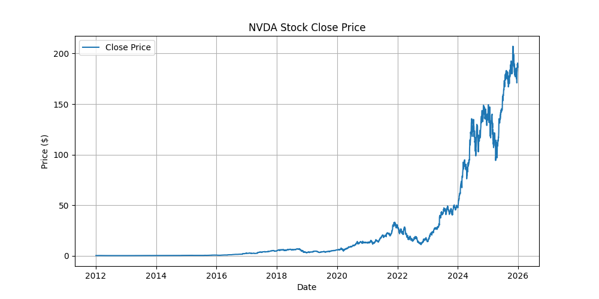
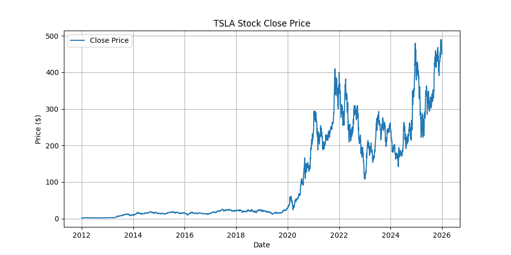
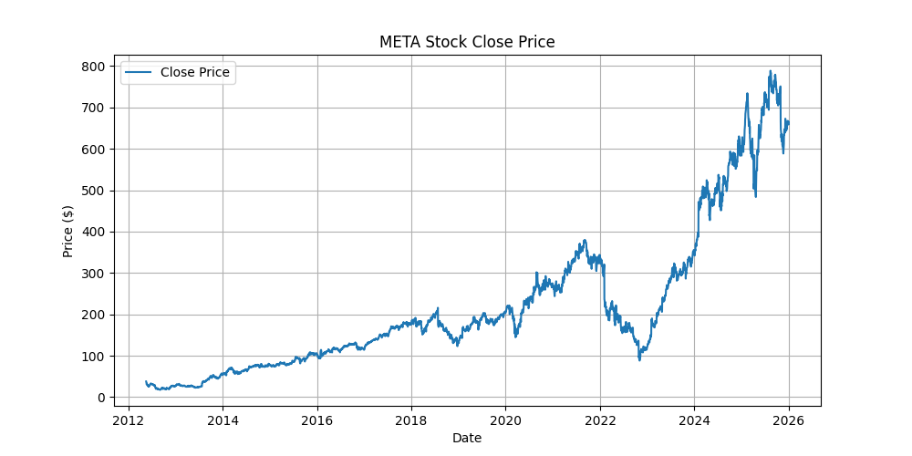

# Agentic Stock Report

## NVDA

### Summary Statistics

|       |   ('Close', 'NVDA') |   ('High', 'NVDA') |   ('Low', 'NVDA') |   ('Open', 'NVDA') |   ('Volume', 'NVDA') |
|:------|--------------------:|-------------------:|------------------:|-------------------:|---------------------:|
| count |         3520        |        3520        |       3520        |        3520        |       3520           |
| mean  |           25.8627   |          26.2991   |         25.3796   |          25.8659   |          4.29895e+08 |
| std   |           46.1625   |          46.8937   |         45.3619   |          46.1968   |          2.42674e+08 |
| min   |            0.260839 |           0.26657  |          0.255568 |           0.26506  |          4.5644e+07  |
| 25%   |            0.537286 |           0.541078 |          0.530066 |           0.536159 |          2.69703e+08 |
| 50%   |            5.18749  |           5.26309  |          5.08238  |           5.19226  |          3.82346e+08 |
| 75%   |           21.2069   |          21.7195   |         20.7737   |          21.1176   |          5.22177e+08 |
| max   |          207.028    |         212.178    |        205.549    |         208.068    |          3.69293e+09 |

### AI-style Analysis

Stock increased by 57853.65% over the year. High volatility detected during the year.

### Price Chart

## TSLA

### Summary Statistics

|       |   ('Close', 'TSLA') |   ('High', 'TSLA') |   ('Low', 'TSLA') |   ('Open', 'TSLA') |   ('Volume', 'TSLA') |
|:------|--------------------:|-------------------:|------------------:|-------------------:|---------------------:|
| count |          3520       |          3520      |        3520       |         3520       |       3520           |
| mean  |           109.749   |           112.178  |         107.207   |          109.771   |          1.04981e+08 |
| std   |           127.532   |           130.388  |         124.582   |          127.615   |          7.47444e+07 |
| min   |             1.51933 |             1.79   |           1.50933 |            1.77467 |          5.4735e+06  |
| 25%   |            14.548   |            14.7653 |          14.2867  |           14.5238  |          6.13042e+07 |
| 50%   |            21.8777  |            22.1983 |          21.4877  |           21.801   |          8.89635e+07 |
| 75%   |           220.173   |           225.21   |         215.065   |          220.779   |          1.2643e+08  |
| max   |           489.88    |           498.83   |         485.33    |          489.88    |          9.14082e+08 |

### AI-style Analysis

Stock increased by 23923.50% over the year. High volatility detected during the year.

### Price Chart

## META

### Summary Statistics

|       |   ('Close', 'META') |   ('High', 'META') |   ('Low', 'META') |   ('Open', 'META') |   ('Volume', 'META') |
|:------|--------------------:|-------------------:|------------------:|-------------------:|---------------------:|
| count |           3425      |          3425      |         3425      |          3425      |       3425           |
| mean  |            219.715  |           222.47   |          216.875  |           219.691  |          2.83314e+07 |
| std   |            178.175  |           180.364  |          175.996  |           178.31   |          2.51907e+07 |
| min   |             17.607  |            18.1433 |           17.4283 |            17.9546 |          4.7261e+06  |
| 25%   |             94.5992 |            96.2079 |           93.2983 |            95.0163 |          1.48289e+07 |
| 50%   |            171.303  |           173.359  |          169.317  |           171.303  |          2.09555e+07 |
| 75%   |            284.761  |           287.78   |          279.21   |           284.026  |          3.22367e+07 |
| max   |            788.824  |           795.065  |          779.658  |           789.972  |          5.73576e+08 |

### AI-style Analysis

Stock increased by 1638.69% over the year. High volatility detected during the year.

### Price Chart

